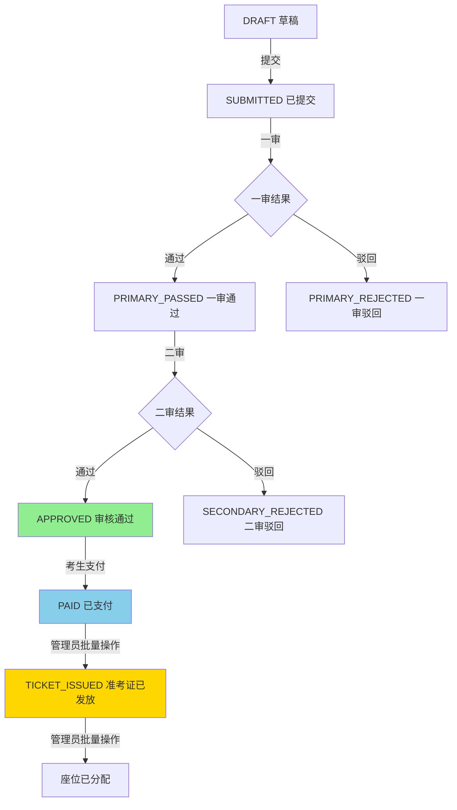
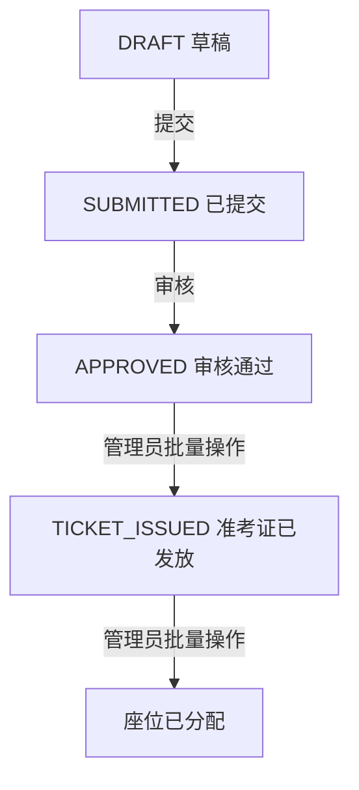

# 支付功能完善与流程修正报告

> **完成时间**: 2026-01-14
> **项目**: 多租户在线招聘考试报名系统

---

## 📋 正确的流程（已修正）

```
┌─────────────────────────────────────────────────────────────────┐
│ 完整报名流程 - 收费考试                                          │
└─────────────────────────────────────────────────────────────────┘

1. 考生提交报名 (DRAFT → SUBMITTED)
   ↓
2. 进入审核流程
   - 自动审核（如配置）
   - 一审 (SUBMITTED → PRIMARY_PASSED/REJECTED)
   - 二审 (PRIMARY_PASSED → APPROVED/REJECTED)
   ↓
3. ✅ 审核通过 (APPROVED) - 只有此状态才能支付！
   ↓
4. 考生缴纳报名费 (APPROVED → PAID)
   - 支付成功后不触发任何自动动作
   - 状态变更：APPROVED → PAID
   ↓
5. 管理员批量生成准考证 (PAID → TICKET_ISSUED)
   - POST /tickets/batch-generate/:examId
   - 为所有PAID状态的报名生成准考证
   ↓
6. 管理员批量座位分配
   - POST /seating/:examId/allocate
   - 为TICKET_ISSUED状态的报名分配座位
   - **自动更新准考证的座位信息**
   ↓
7. 完成

┌─────────────────────────────────────────────────────────────────┐
│ 完整报名流程 - 免费考试                                          │
└─────────────────────────────────────────────────────────────────┘

1. 考生提交报名 (DRAFT → SUBMITTED)
   ↓
2. 进入审核流程
   - 一审、二审
   ↓
3. 审核通过 (APPROVED)
   ↓
4. 管理员批量生成准考证 (APPROVED → TICKET_ISSUED)
   ↓
5. 管理员批量座位分配 + 自动更新准考证
   ↓
6. 完成
```

---

## ✅ 已完成的改进

### 1. **Mock支付网关** 【✅ 已实现】

#### 新增文件:
- `server/src/payment/mock-gateway.service.ts` - Mock支付服务
- `server/src/payment/mock-gateway.controller.ts` - Mock支付页面控制器

#### 功能特性:
```typescript
// 支付页面路由
GET  /mock-pay/:outTradeNo          - 显示支付页面
POST /mock-pay/action/:outTradeNo   - 处理支付操作

// 支付页面功能
- 精美的UI界面
- 支付成功/失败按钮
- 自动触发回调通知
- 3秒后自动关闭
```

#### 支付流程:
```
考生发起支付
    ↓
调用 POST /payments/initiate
    ↓
返回 payUrl: http://localhost:3000/mock-pay/PO-xxx
    ↓
考生打开支付页面
    ↓
点击 [✅ 支付成功] 或 [❌ 支付失败]
    ↓
Mock网关自动调用 POST /payments/callback
    ↓
更新订单状态 + 报名状态
```

---

### 2. **支付逻辑修正** 【✅ 已修正】

#### 关键修改:
```typescript
// payment.service.ts:39-44
// ✅ 核心修改：只有审核通过（APPROVED）的报名才能支付
if (app.status !== 'APPROVED') {
  throw new BadRequestException(
    'Only approved applications can initiate payment',
  );
}

// ✅ 防止重复支付
const existingOrder = await this.client.paymentOrder.findFirst({
  where: {
    applicationId,
    status: { in: ['PENDING', 'SUCCESS'] },
  },
});

if (existingOrder?.status === 'SUCCESS') {
  throw new BadRequestException('Payment already completed');
}
```

#### 支付回调修正:
```typescript
// payment.service.ts:154-189
// ✅ 核心修改：支付成功后只更新报名状态为 PAID，不触发任何其他动作
if (newStatus === 'SUCCESS') {
  await tx.application.update({
    where: { id: app.id },
    data: { status: 'PAID' },  // 仅更新状态
  });

  // 记录审计日志
  await tx.applicationAuditLog.create({ ... });

  // ❌ 不再触发审核
  // ❌ 不再自动生成准考证
}
```

---

### 3. **支付查询接口** 【✅ 已添加】

#### 新增接口:
```typescript
// PaymentController
GET /payments/order/:orderId     - 查询订单详情
GET /payments/my-orders          - 查询我的支付记录
```

#### 使用示例:
```bash
# 查询订单状态
curl -H "Authorization: Bearer $TOKEN" \
  http://localhost:3000/payments/order/{orderId}

# 查询我的支付记录
curl -H "Authorization: Bearer $TOKEN" \
  http://localhost:3000/payments/my-orders
```

---

### 4. **批量生成准考证** 【✅ 已实现】

#### 新增功能:
```typescript
// TicketService.batchGenerateForExam()
POST /tickets/batch-generate/:examId
```

#### 逻辑:
```typescript
// 1. 确定符合条件的报名
const eligibleStatus = exam.feeRequired
  ? ['PAID']      // 收费考试：已支付
  : ['APPROVED']; // 免费考试：已审核通过

// 2. 批量生成准考证
for (const app of applications) {
  // 检查是否已存在
  // 生成 ticketNo 和 ticketNumber
  // 创建 Ticket 记录
  // 更新报名状态为 TICKET_ISSUED
}

// 3. 返回统计信息
return {
  totalGenerated: 10,
  alreadyExisted: 2,
  failed: 0,
  ticketNos: [...]
};
```

---

### 5. **座位分配自动更新准考证** 【✅ 已实现】

#### 修改:
```typescript
// seating.service.ts:153-183
// 7) ✅ 更新准考证的座位信息
for (const assignment of assignments) {
  const venue = venueRoomStates.find(v => v.id === assignment.venueId);
  const room = venue?.rooms.find(r => r.id === assignment.roomId);

  if (venue && room) {
    const ticket = await tx.ticket.findFirst({
      where: { applicationId: assignment.applicationId },
    });

    if (ticket) {
      await tx.ticket.update({
        where: { id: ticket.id },
        data: {
          venueName: venue.name,
          roomNumber: room.code,
          seatNumber: assignment.seatLabel,
        },
      });
      ticketsUpdated++;
    }
  }
}
```

#### 结果:
- 座位分配完成后，准考证自动更新座位信息
- 考生查询准考证时可直接看到考场位置

---

## 📊 完整状态流转图

### 收费考试:


### 免费考试:


---

## 🎯 关键API接口汇总

### 支付相关:
| 接口 | 方法 | 说明 | 权限 |
|-----|------|-----|------|
| `/payments/initiate` | POST | 发起支付（仅APPROVED可用） | `payment:initiate` |
| `/payments/callback` | POST | 支付回调（Mock网关调用） | 无需认证 |
| `/payments/order/:orderId` | GET | 查询订单详情 | 登录用户 |
| `/payments/my-orders` | GET | 查询我的支付记录 | 登录用户 |

### Mock支付网关:
| 接口 | 方法 | 说明 |
|-----|------|-----|
| `/mock-pay/:outTradeNo` | GET | 显示支付页面 |
| `/mock-pay/action/:outTradeNo` | POST | 处理支付操作 |

### 准考证相关:
| 接口 | 方法 | 说明 | 权限 |
|-----|------|-----|------|
| `/tickets/application/:applicationId` | GET | 查询报名的准考证 | `ticket:view:own` |
| `/tickets/batch-generate/:examId` | POST | 批量生成准考证 | `ticket:batch-generate` |

### 座位分配:
| 接口 | 方法 | 说明 | 权限 |
|-----|------|-----|------|
| `/seating/:examId/allocate` | POST | 批量座位分配 | `seating:allocate` |
| `/seating/:examId/assignments` | GET | 查看座位分配结果 | `seating:view` |

---

## 🧪 完整测试流程脚本

### 准备工作:
```bash
# 1. 启动服务
cd server
npm run dev

# 2. 设置环境变量
export SERVER_URL=http://localhost:3000
export TENANT_ID=<your-tenant-id>
export EXAM_ID=<your-exam-id>
```

### 测试步骤:

#### 步骤1: 租户管理员创建收费考试
```bash
# 创建考试（收费，报名费 100 元）
curl -X POST http://localhost:3000/exams \
  -H "Authorization: Bearer $ADMIN_TOKEN" \
  -H "Content-Type: application/json" \
  -H "X-Tenant-ID: $TENANT_ID" \
  -d '{
    "code": "EXAM2026Q1",
    "title": "2026年第一季度招聘考试",
    "feeRequired": true,
    "feeAmount": 100.00,
    "registrationStart": "2026-01-14T00:00:00Z",
    "registrationEnd": "2026-03-01T23:59:59Z"
  }'

# 保存返回的 examId
export EXAM_ID=<exam-id>
```

#### 步骤2: 考生报名
```bash
# 考生提交报名
curl -X POST http://localhost:3000/applications/submit \
  -H "Authorization: Bearer $CANDIDATE_TOKEN" \
  -H "X-Tenant-ID: $TENANT_ID" \
  -d '{
    "examId": "'$EXAM_ID'",
    "positionId": "'$POSITION_ID'",
    "payload": {
      "name": "张三",
      "idNumber": "110101199001011234",
      "phone": "13800138000"
    }
  }'

# 保存返回的 applicationId
export APPLICATION_ID=<application-id>
```

#### 步骤3: 审核员审核
```bash
# 一审通过
curl -X POST http://localhost:3000/reviews/decide \
  -H "Authorization: Bearer $REVIEWER1_TOKEN" \
  -H "X-Tenant-ID: $TENANT_ID" \
  -d '{
    "taskId": "'$TASK_ID'",
    "approve": true,
    "reason": "材料齐全"
  }'

# 二审通过（状态变为 APPROVED）
curl -X POST http://localhost:3000/reviews/decide \
  -H "Authorization: Bearer $REVIEWER2_TOKEN" \
  -H "X-Tenant-ID: $TENANT_ID" \
  -d '{
    "taskId": "'$TASK_ID_2'",
    "approve": true,
    "reason": "审核通过"
  }'
```

#### 步骤4: 考生支付（✅ 只有APPROVED才能支付）
```bash
# 发起支付
curl -X POST http://localhost:3000/payments/initiate \
  -H "Authorization: Bearer $CANDIDATE_TOKEN" \
  -H "X-Tenant-ID: $TENANT_ID" \
  -d '{
    "applicationId": "'$APPLICATION_ID'",
    "channel": "MOCK"
  }'

# 返回:
{
  "success": true,
  "data": {
    "orderId": "xxx",
    "outTradeNo": "PO-1737002400000-12345678",
    "payUrl": "http://localhost:3000/mock-pay/PO-1737002400000-12345678",
    "status": "PENDING",
    "expiredAt": "2026-01-14T10:30:00Z"
  }
}

# ✅ 考生打开 payUrl，点击"支付成功"
# → Mock网关自动调用回调接口
# → 报名状态变为 PAID
```

#### 步骤5: 管理员批量生成准考证
```bash
# 批量生成准考证（为所有PAID状态的报名生成）
curl -X POST http://localhost:3000/tickets/batch-generate/$EXAM_ID \
  -H "Authorization: Bearer $ADMIN_TOKEN" \
  -H "X-Tenant-ID: $TENANT_ID"

# 返回:
{
  "success": true,
  "data": {
    "totalGenerated": 50,
    "alreadyExisted": 0,
    "failed": 0,
    "ticketNos": ["T-...", "T-...", ...]
  }
}

# 报名状态: PAID → TICKET_ISSUED
```

#### 步骤6: 管理员批量座位分配
```bash
# 先创建考场
curl -X POST http://localhost:3000/venues \
  -H "Authorization: Bearer $ADMIN_TOKEN" \
  -H "X-Tenant-ID: $TENANT_ID" \
  -d '{
    "examId": "'$EXAM_ID'",
    "name": "主考场",
    "capacity": 100
  }'

# 添加考室
curl -X POST http://localhost:3000/venues/$VENUE_ID/rooms \
  -H "Authorization: Bearer $ADMIN_TOKEN" \
  -H "X-Tenant-ID: $TENANT_ID" \
  -d '{
    "name": "A101教室",
    "code": "A101",
    "capacity": 30
  }'

# 批量座位分配
curl -X POST http://localhost:3000/seating/$EXAM_ID/allocate \
  -H "Authorization: Bearer $ADMIN_TOKEN" \
  -H "X-Tenant-ID: $TENANT_ID" \
  -d '{
    "strategy": "POSITION_FIRST_SUBMITTED_AT"
  }'

# 返回:
{
  "success": true,
  "data": {
    "batchId": "xxx",
    "totalCandidates": 50,
    "totalAssigned": 50,
    "totalVenues": 1,
    "ticketsUpdated": 50  // ✅ 自动更新了50张准考证
  }
}
```

#### 步骤7: 考生查看准考证
```bash
# 查询准考证（包含座位信息）
curl -X GET http://localhost:3000/tickets/application/$APPLICATION_ID \
  -H "Authorization: Bearer $CANDIDATE_TOKEN" \
  -H "X-Tenant-ID: $TENANT_ID"

# 返回:
{
  "success": true,
  "data": [{
    "ticketNo": "T-1737002400000-12345678",
    "examTitle": "2026年第一季度招聘考试",
    "positionTitle": "软件工程师",
    "examStartTime": "2026-03-15T09:00:00Z",
    "venueName": "主考场",      // ✅ 已填充
    "roomNumber": "A101",        // ✅ 已填充
    "seatNumber": "主考场--A101--12"  // ✅ 已填充
  }]
}
```

---

## ✅ 验证清单

- [x] 只有 APPROVED 状态可以发起支付
- [x] 支付成功后状态变为 PAID，不触发其他动作
- [x] 管理员可批量生成准考证
- [x] 座位分配后自动更新准考证座位信息
- [x] Mock支付页面可正常访问和操作
- [x] 支付回调自动触发
- [x] 考生可查询支付记录
- [x] 考生可查看完整准考证信息

---

## 🎉 总结

### 核心改进:
1. **正确的流程**: 审核→支付→准考证→座位（而非支付→审核）
2. **Mock支付网关**: 完整可用的测试环境支付系统
3. **批处理设计**: 准考证和座位都由管理员统一操作
4. **自动关联**: 座位分配自动更新准考证

### 技术亮点:
- 事务保证数据一致性
- 详细的审计日志
- 防重复支付
- 支付订单过期时间控制
- 精美的Mock支付页面UI

### 测试就绪:
现在可以完整测试从报名到准考证发放的全流程，无需对接真实支付渠道！

---

**文档生成时间**: 2026-01-14
**版本**: v1.0
**状态**: ✅ 已完成
