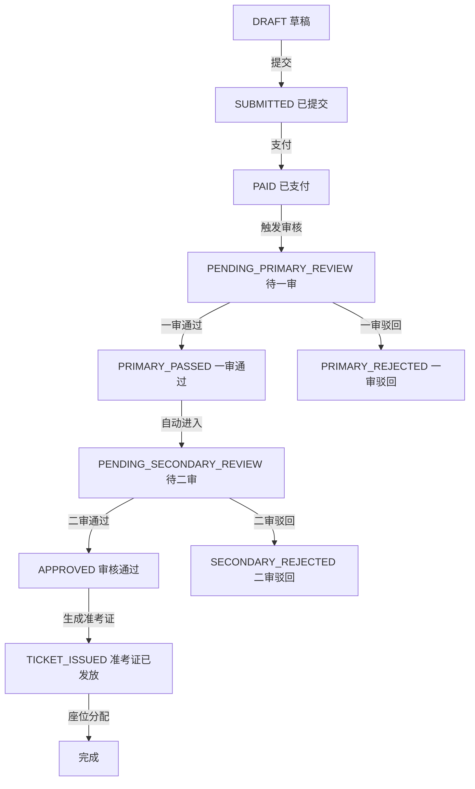
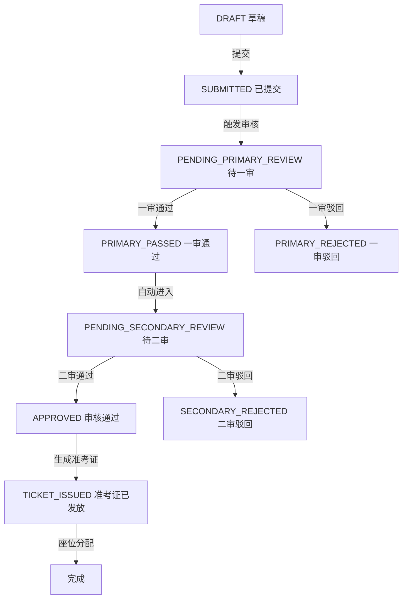

# 完整报名流程分析报告

> **生成时间**: 2026-01-14
> **项目**: 多租户在线招聘考试报名系统

---

## 📊 流程概览

```
租户设置 ──→ 考试设置 ──→ 报名表单发布 ──→ 考生报名 ──→
缴纳报名费 ──→ 资料审核 ──→ 生成准考证 ──→ 座位分配 ──→
发送准考证
```

---

## ✅ 已实现功能评估

### 1. 租户设置 【✅ 完整】

**涉及模块**: `tenant`, `super-admin`

**数据模型**:
```typescript
- Tenant (租户基本信息)
- UserTenantRole (用户-租户-角色关联)
```

**核心功能**:
- ✅ 创建租户
- ✅ Schema 自动创建和隔离
- ✅ 分配租户管理员

**评价**: 功能完整，支持多租户数据隔离

---

### 2. 考试设置 【✅ 完整】

**涉及模块**: `exam`

**数据模型**:
```typescript
- Exam (考试主表)
  - feeRequired: Boolean    // 是否收费
  - feeAmount: Decimal      // 报名费金额
  - registrationStart/End   // 报名时间窗口
  - formTemplate: JsonB     // 表单模板

- Position (岗位)
- Subject (考试科目)
```

**核心功能**:
- ✅ 创建/编辑考试
- ✅ 设置报名费用
- ✅ 配置报名时间窗口
- ✅ 岗位和科目管理

**评价**: 基础完善，支持收费/免费考试配置

---

### 3. 报名表单定义及发布 【⚠️ 部分实现】

**涉及模块**: `exam`

**数据模型**:
```typescript
- Exam.formTemplate (JsonB)  // 表单JSON定义
- Exam.formTemplateId        // 表单模板ID
```

**缺失功能**:
- ❌ 表单可视化配置界面
- ❌ 表单版本管理
- ❌ 表单字段验证规则

**建议**: 表单定义存在，但缺少配置服务，建议补充表单管理模块

---

### 4. 考生报名 【✅ 完整】

**涉及模块**: `application`

**核心实现**: `ApplicationService`

**功能覆盖**:
- ✅ 保存草稿 (DRAFT)
- ✅ 提交报名 (SUBMITTED)
- ✅ 报名时间窗口验证
- ✅ 附件上传关联
- ✅ 一人一考试一岗位限制

**代码位置**: [server/src/application/application.service.ts:22-81](server/src/application/application.service.ts#L22-L81)

**评价**: 功能完整，逻辑清晰

---

### 5. 缴纳报名费 【❌ 严重不足】

**涉及模块**: `payment`

**数据模型**:
```typescript
- PaymentOrder
  - outTradeNo: String     // 商户订单号
  - channel: String        // ALIPAY | WECHAT | MOCK
  - status: String         // PENDING | SUCCESS | FAILED
  - transactionId: String  // 第三方交易号
  - expiredAt: DateTime    // 过期时间（未使用）
```

**现有实现**:
```typescript
// payment.service.ts:25-68
async initiate(request: InitiatePaymentRequest) {
  // 创建支付订单
  // MOCK通道只返回假URL ❌
  if (channel === PaymentChannel.MOCK) {
    return {
      payUrl: `http://mock-pay.com/pay/${outTradeNo}`, // 不可访问
    };
  }
}

// payment.service.ts:70-123
async handleCallback(request: PaymentCallbackRequest) {
  // 更新支付状态
  // 更新报名状态为 PAID
  // 记录审计日志
}
```

**核心问题**:

#### ❌ **问题1: Mock支付网关不存在**
- 返回的URL `http://mock-pay.com/pay/xxx` 无法访问
- 缺少真实的模拟支付页面
- 无法完成支付流程测试

#### ❌ **问题2: 缺少支付状态查询**
- 考生无法查询支付进度
- 管理员无法查看支付记录
- 缺少 `GET /payments/query/:orderId` 接口

#### ❌ **问题3: 支付超时未处理**
- `PaymentOrder.expiredAt` 字段未使用
- 没有定时任务清理过期订单
- 过期订单不自动取消

#### ❌ **问题4: 支付后流程断裂**
- 支付成功后，状态变为 `PAID`
- **但不会自动触发审核流程**
- 需要手动调用审核接口

**代码位置**: [server/src/payment/payment.service.ts](server/src/payment/payment.service.ts)

**评价**: ⭐ **这是整个流程中最薄弱的环节，必须重点改进**

---

### 6. 资料审核 【✅ 完整】

**涉及模块**: `review`

**数据模型**:
```typescript
- ReviewTask (审核任务)
- Review (审核记录)
- ExamReviewer (审核员配置)
```

**审核流程**:
```
SUBMITTED/PAID
    ↓
PENDING_PRIMARY_REVIEW (待一审)
    ↓ [pullNext() 拉取任务]
PRIMARY_PASSED / PRIMARY_REJECTED
    ↓ [一审通过]
PENDING_SECONDARY_REVIEW (待二审)
    ↓ [decide() 做出决策]
APPROVED / SECONDARY_REJECTED
```

**核心功能**:
- ✅ 任务锁定机制 (10分钟TTL)
- ✅ 两级审核流程
- ✅ 审核决策记录
- ✅ 审计日志

**代码位置**: [server/src/review/review.service.ts](server/src/review/review.service.ts)

**评价**: 功能完善，逻辑严谨

---

### 7. 定义考场 【✅ 完整】

**涉及模块**: `seating`

**数据模型**:
```typescript
- Venue (考场)
- Room (考室)
```

**核心功能**:
- ✅ 考场创建和管理
- ✅ 考室容量配置
- ✅ 多考场支持

**评价**: 基础功能完整

---

### 8. 座位分配 【✅ 完整】

**涉及模块**: `seating`

**数据模型**:
```typescript
- SeatAssignment (座位分配)
- AllocationBatch (分配批次)
```

**分配策略**:
- ✅ 按岗位分组
- ✅ 按提交时间排序
- ✅ 自动填充考室
- ✅ 容量控制

**代码位置**: [server/src/seating/seating.service.ts:35-173](server/src/seating/seating.service.ts#L35-L173)

**评价**: 算法清晰，支持基本策略

---

### 9. 准考证发放 【⚠️ 部分实现】

**涉及模块**: `ticket`

**数据模型**:
```typescript
- Ticket (准考证)
  - venueName, roomNumber, seatNumber  // 座位信息
  - qrCode, barcode                    // 验证码
```

**现有实现**:
```typescript
async generate(applicationId: string) {
  // 生成准考证
  // 包含考试、岗位、考生信息
  // ❌ 但座位信息为空！
}
```

**缺失功能**:
- ❌ 准考证生成时未关联座位信息
- ❌ 座位分配后未更新已发放的准考证
- ❌ 缺少二维码/条形码生成逻辑

**代码位置**: [server/src/ticket/ticket.service.ts:16-53](server/src/ticket/ticket.service.ts#L16-L53)

**评价**: 基础框架存在，但与座位系统未打通

---

## 🔄 完整状态流转图

### 收费考试流程:


### 免费考试流程:


---

## ❌ 关键缺失功能

### 1. **支付后未自动触发审核** 【高优先级】

**问题**: 支付成功后，状态变为 `PAID`，但不会自动进入审核队列

**影响**: 需要手动触发审核，流程断裂

**修复方案**:
```typescript
// payment.service.ts:97-106
if (newStatus === 'SUCCESS') {
  await tx.application.update({
    where: { id: app.id },
    data: { status: 'PAID' },
  });

  // ✅ 添加: 自动触发审核
  await tx.application.update({
    where: { id: app.id },
    data: { status: 'PENDING_PRIMARY_REVIEW' },
  });

  // ✅ 添加: 创建审核任务
  await tx.reviewTask.create({
    data: {
      applicationId: app.id,
      stage: 'PRIMARY',
      status: 'OPEN',
    },
  });
}
```

---

### 2. **审核通过后未自动生成准考证** 【高优先级】

**问题**: 审核 `APPROVED` 后，需要手动调用准考证生成接口

**影响**: 流程不连贯，考生体验差

**修复方案**:
```typescript
// review.service.ts:143-207
if (toStatus === 'APPROVED') {
  // ✅ 自动生成准考证
  const ticketNo = await this.ticketService.generate(app.id);

  await tx.application.update({
    where: { id: app.id },
    data: { status: 'TICKET_ISSUED' },
  });

  // ✅ 发送通知
  await this.notificationService.send({
    to: app.candidateId,
    template: 'TICKET_ISSUED',
    data: { ticketNo },
  });
}
```

---

### 3. **座位分配后未更新准考证** 【中优先级】

**问题**: 座位分配完成后，已生成的准考证中座位信息为空

**影响**: 考生无法知道考场位置

**修复方案**:
```typescript
// seating.service.ts:172 之后添加
// 6) Update tickets with seat info
for (const assignment of assignments) {
  const ticket = await tx.ticket.findFirst({
    where: { applicationId: assignment.applicationId },
  });

  if (ticket) {
    await tx.ticket.update({
      where: { id: ticket.id },
      data: {
        venueName: venueMap[assignment.venueId].name,
        roomNumber: roomMap[assignment.roomId].code,
        seatNumber: assignment.seatLabel,
      },
    });
  }
}
```

---

### 4. **Mock支付网关缺失** 【高优先级⭐】

**问题**: 当前返回的Mock支付URL无法访问

**影响**: 无法完整测试支付流程

**需要实现**:
1. Mock支付服务器 (`server/src/payment/mock-gateway/`)
2. 支付页面 (支持成功/失败操作)
3. 自动回调接口

详见下方 **改进方案**

---

### 5. **支付状态查询缺失** 【中优先级】

**缺少接口**:
- `GET /payments/order/:orderId` - 查询订单详情
- `GET /payments/my-orders` - 考生查询自己的支付记录
- `GET /payments/exam/:examId/orders` - 管理员查询考试支付记录

---

### 6. **支付超时处理缺失** 【低优先级】

**问题**: 过期订单不自动取消

**建议**: 添加定时任务 (使用 `@nestjs/schedule`)
```typescript
@Cron('0 */10 * * * *') // 每10分钟执行
async cleanExpiredOrders() {
  await this.prisma.paymentOrder.updateMany({
    where: {
      status: 'PENDING',
      expiredAt: { lt: new Date() },
    },
    data: { status: 'CANCELLED' },
  });
}
```

---

## 🚀 Mock支付网关实现方案

### 架构设计:

```
┌─────────────────────────────────────────────────────┐
│  NestJS Backend                                     │
│                                                     │
│  ┌──────────────────┐    ┌────────────────────┐   │
│  │ PaymentService   │───▶│ MockGatewayService │   │
│  └──────────────────┘    └────────────────────┘   │
│           │                       │                 │
│           │                       ▼                 │
│           │              ┌────────────────────┐    │
│           │              │ MockPaymentPage    │    │
│           │              │ /mock-pay/:orderId │    │
│           │              └────────────────────┘    │
│           │                       │                 │
│           ▼                       │                 │
│  ┌──────────────────┐            │                 │
│  │ PaymentController│◀───────────┘                 │
│  │ POST /callback   │                              │
│  └──────────────────┘                              │
└─────────────────────────────────────────────────────┘
```

### 实现步骤:

1. **创建 MockGatewayService**
   - 生成可访问的支付链接
   - 存储订单临时状态
   - 提供简单HTML支付页面

2. **创建支付页面路由**
   - `GET /mock-pay/:outTradeNo` - 显示支付页面
   - 页面包含 [支付成功] [支付失败] 按钮
   - 点击后触发回调

3. **完善回调处理**
   - 验证订单状态
   - 防止重复回调
   - 自动触发审核流程

4. **添加支付查询接口**
   - 查询订单状态
   - 查询支付历史

---

## 📝 改进优先级总结

| 优先级 | 功能 | 影响 | 工作量 |
|-------|------|-----|--------|
| ⭐⭐⭐ | 实现Mock支付网关 | 阻塞测试 | 4小时 |
| ⭐⭐⭐ | 支付后自动触发审核 | 流程断裂 | 1小时 |
| ⭐⭐⭐ | 审核通过后生成准考证 | 流程断裂 | 1小时 |
| ⭐⭐ | 座位分配后更新准考证 | 信息缺失 | 2小时 |
| ⭐⭐ | 添加支付查询接口 | 功能缺失 | 2小时 |
| ⭐ | 支付超时处理 | 数据清理 | 1小时 |

---

## 🎯 下一步行动建议

### Phase 1: 支付模块改进 (预计6小时)
1. ✅ 实现 MockGatewayService
2. ✅ 创建Mock支付页面
3. ✅ 添加支付查询接口
4. ✅ 完善回调处理

### Phase 2: 流程自动化 (预计4小时)
1. ✅ 支付成功后自动进入审核
2. ✅ 审核通过后自动生成准考证
3. ✅ 座位分配后更新准考证

### Phase 3: 优化补充 (预计2小时)
1. ✅ 添加支付超时定时任务
2. ✅ 补充表单配置服务
3. ✅ 完善准考证二维码生成

---

## 📌 总结

### ✅ 已完成:
- 租户管理和权限控制
- 考试和岗位配置
- 考生报名流程
- 两级审核系统
- 座位分配算法
- 基础准考证生成

### ❌ 需改进:
- **支付模块** (最薄弱环节)
- 流程自动化
- 准考证与座位关联

### 💡 评价:
整体架构清晰，数据模型完善，但**支付流程实现不足，流程自动化缺失**。

通过本次改进后，可实现完整的端到端测试流程！
