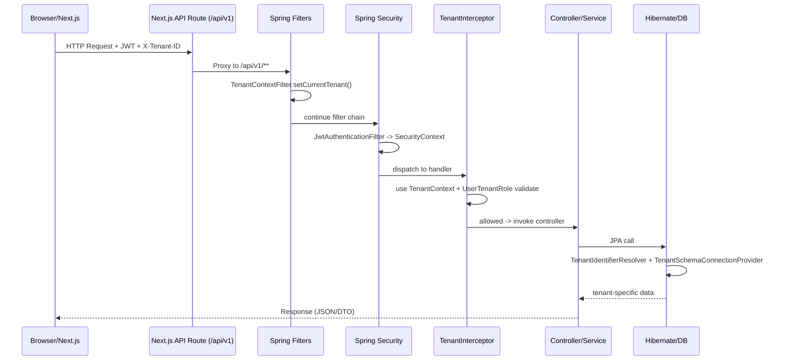

# 考试报名系统认证 / 授权 / 多租户 & OpenAPI 基线

> 目标：作为本项目的**项目宪章/开发基线**，统一说明：
> - 认证/授权模型（SSO + RBAC）
> - 多租户租户上下文传递与数据库隔离
> - 请求生命周期（前端 → 网关/Next.js → 后端 → DB）
> - OpenAPI 作为前后端契约的规范及更新流程

---

## 1. 总体架构原则

1. **单体 + 多租户**：后端是 Spring Boot 单体，使用 PostgreSQL **Schema 多租户**，`public` 存放全局数据，各 `tenant_xxx` 存放租户业务数据。
2. **SSO + 多租户角色**：
   - `User` 是全局实体（表：`public.users`），不再绑定单一 `tenantId`。
   - `UserTenantRole`（表：`public.user_tenant_roles`）描述“某个 User 在某个 Tenant 拥有哪些角色（TENANT_ADMIN/PRIMARY_REVIEWER/…）”。
3. **JWT 认证 + RBAC 授权**：
   - 认证：JWT 只标识“这个人是谁”（UserId、全局角色等）。
   - 授权：结合 **当前租户上下文 + UserTenantRole + 权限映射** 决定是否可以访问某个资源。
4. **前后端契约优先：OpenAPI 为唯一真相**：
   - 后端通过 springdoc 生成 **OpenAPI 3** 规范，并挂载 Swagger UI 作为查看界面。
   - 所有前端/自动化测试均应以 OpenAPI 为契约来源，而非散落的文档或代码猜测。

---

## 2. 请求生命周期（多租户 & SSO）

### 2.1 从浏览器到后端

1. **浏览器 / Next.js 应用**：
   - 将登录后获得的 JWT 写入 `Authorization: Bearer <token>`。
   - 当前选中的租户 ID 写入 `X-Tenant-ID: <tenant-uuid>`（或 URL Path 中）。
2. **Next.js 反向代理**（`web/next.config.js`）：
   - 所有 `/api/v1/**` 请求重写到后端 `http://<BACKEND_ORIGIN>/api/v1/**`。
   - 保留原始 Header（包括 `Authorization` 和 `X-Tenant-ID`）。

### 2.2 后端请求处理流水线

按时间顺序简述（简化）：

1. **TenantContextFilter（多租户 Filter）**
   - 从 `X-Tenant-ID` 或 URL Path 中提取 `tenantId`。
   - 调用 `TenantContext.setCurrentTenant(TenantId)` 将租户信息写入 ThreadLocal。
2. **Spring Security 过滤器链**
   - `JwtAuthenticationFilter` 从 `Authorization` 提取 JWT，解析 UserId、全局角色等，构建 `Authentication` 放入 `SecurityContext`。
3. **TenantInterceptor（多租户权限拦截器）**
   - 通过 `TenantContext.getCurrentTenant()` 获取租户；
   - 通过 `SecurityContext` 获取当前 UserId；
   - 使用 `UserTenantRoleRepository` 校验“用户在当前租户是否有所需角色”（TENANT_ADMIN、REVIEWER 等）；
   - 部分公开端点（如租户发现接口、首次报名）按规则放行。
4. **Controller / 应用服务**
   - Controller 使用 `@PreAuthorize` 基于权限字符串进行细粒度授权；
   - 应用服务可通过 `TenantContextPort` 获取当前 `TenantId`，进行业务逻辑判断。
5. **Hibernate 多租户**
   - `TenantIdentifierResolver` 从 `TenantContext` 提供当前 tenant identifier；
   - `TenantSchemaConnectionProvider` 基于 identifier 查询 `public.tenants.schema_name`，通过 `SET search_path TO tenant_xxx, public` 完成 **schema 级路由**；
   - 所有 JPA 查询自动运行在对应租户 schema 上。

> 关键点：**认证只解决“你是谁”，TenantContext + UserTenantRole 决定“你在哪个租户、能做什么”。**

---

## 3. 认证 / 授权机制基线

### 3.1 认证（Authentication）

1. 登录接口：`POST /auth/login`
   - 请求体：`{ username, password, rememberMe? }`。
   - 响应体：`LoginResponse { token, tokenType, expiresIn, user: UserResponse }`。
   - JWT 不携带特定 tenantId，只包括 UserId、全局角色、用户状态等。
2. 选租户接口：`POST /auth/select-tenant`
   - 请求体：`{ tenantId }`；
   - 服务端使用 `UserTenantRoleRepository` 校验当前用户在该租户的角色集合；
   - 返回新的 `LoginResponse`（可选：租户内权限增强版 token）。
3. Token 刷新：`POST /auth/refresh`
   - 使用旧 JWT 换取新 JWT，保持相同用户 & 租户上下文语义。

### 3.2 授权（Authorization）

1. **全局角色**（如 SUPER_ADMIN）
   - 定义在 User 上，对所有租户生效，用于跨租户管理能力（如创建租户）。
2. **租户内角色**（TENANT_ADMIN / PRIMARY_REVIEWER / SECONDARY_REVIEWER / CANDIDATE ...）
   - 存储在 `UserTenantRole`；
   - 配合当前 `TenantId` 做授权判断：`hasRole(userId, tenantId, Role)`。
3. **权限字符串（Authorities）**
   - `@PreAuthorize("hasAuthority('APPLICATION_CREATE')")` 等表达式用于控制接口；
   - 权限由“全局角色 + 当前租户角色”映射而来，映射规则集中管理（避免散落判断）。

> **约束**：新增业务能力时，必须先在“角色 → 权限 → 接口”的映射层定义清楚，再实现 Controller 和前端按钮显示控制。

---

## 4. OpenAPI 契约规范与更新流程

### 4.1 基本约定

1. **规范来源**：
   - 使用 springdoc 生成 OpenAPI 3 文档；
   - 实时文档入口：`/api/v1/v3/api-docs`；
   - Swagger UI：`/api/v1/swagger-ui.html`。
2. **路径规范**：
   - `server.servlet.context-path=/api/v1`；
   - Controller 上禁止再写 `/api`、`/v1` 前缀，只写资源相对路径，例如 `/auth`, `/applications`, `/tenants/{tenantId}/exams`。
3. **时间格式 & 时区**：
   - 所有日期时间字段采用字符串格式 `yyyy-MM-dd HH:mm:ss`；
   - 时区统一为 `Asia/Shanghai`，在 DTO / OpenAPI 注释中注明。

### 4.2 新功能开发时如何更新 OpenAPI

1. **设计阶段**：
   - 先在接口设计草案中写明：路径、HTTP 方法、请求/响应体结构、错误码；
   - 明确角色/权限要求，并在 Controller 上使用 `@Operation` + `@PreAuthorize` 进行标注。
2. **实现阶段**：
   - DTO 上使用 `@Schema` 精确描述字段含义、示例、必填性；
   - Controller 方法上使用 `@Operation`、`@ApiResponse` 指定成功/失败响应模型（包括 `ErrorResponse`）。
3. **导出阶段**（本地）：
   - 确保后端启动在本地（`./scripts/start-backend.ps1 -Profile dev`）；
   - 通过工具脚本（如 `npm run openapi:export`）拉取 `/api/v1/v3/api-docs` 并保存到 `web/openapi/exam-system-api.json`；
   - 提交该 JSON 作为契约快照，方便前端和测试使用。
4. **前端对接**：
   - 使用 `web/scripts/generate-api-client.js`（`npm run openapi:generate`）从 JSON 生成类型定义和 `client-generated.ts`；
   - 前端组件优先使用生成的类型，而不是手写接口类型；
   - 尽量通过统一 API 客户端（`apiClient` 或 wrapper）封装调用，减少散乱 fetch。

> **要求**：任何涉及 API 变更（新增/修改字段、改变状态码）都必须同时更新 OpenAPI，并在 MR 中包含 `exam-system-api.json` 更新，保证前后端及测试的同步。

---

## 5. 后续扩展与演进建议

1. **统一 ErrorResponse 定义**：
   - 确保 `ErrorResponse` DTO 与 OpenAPI `components.schemas.ErrorResponse` 完全一致；
   - 前端 Zod `ErrorResponse` 应严格按该 schema 实现。
2. **权限矩阵文档化**：
   - 在 `role-based-ui-feature-mapping.md` 基础上，继续扩展“角色 → 权限 → API → 前端菜单/按钮”的完整矩阵。
3. **契约测试（Contract Test）**：
   - 通过 Dredd / Playwright 等工具，对关键流程建立基于 OpenAPI 的契约测试，确保后端改动不会悄悄破坏前端调用。

本文件作为认证/授权/多租户 & OpenAPI 的**基础约定**，后续如有新增能力（如支付、成绩、更多角色），应优先更新此处原则，再落地具体实现。

---

## 6. 请求生命周期 + 多租户 & SSO 时序图（概念）

