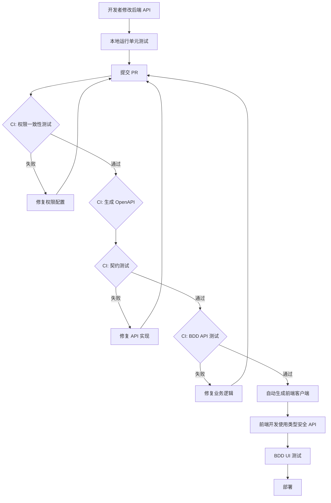

# 前后端集成重构方案

## 问题诊断报告

### 📊 当前问题概览

基于代码分析和BDD测试执行情况,识别出以下核心问题:

| 问题分类 | 具体表现 | 影响范围 | 优先级 |
|---------|---------|---------|--------|
| **契约不一致** | 前端API调用与后端定义不匹配 | 频繁500/403错误 | 🔴 P0 |
| **权限配置碎片化** | `hasRole()` 和 `hasAuthority()` 混用 | 权限验证失败 | 🔴 P0 |
| **缺少类型安全** | 手工编写API调用代码,易出错 | 开发效率低 | 🟡 P1 |
| **测试策略缺失** | BDD直接测UI,缺少API契约测试 | 难以定位问题 | 🟡 P1 |
| **文档同步问题** | OpenAPI与实际代码不同步 | 前端开发困难 | 🟢 P2 |

### 🔍 根因分析

#### 1. 权限注解不一致 (235处 `@PreAuthorize`)

**问题示例**:
```java
// TenantBackupController.java - 使用 hasRole()
@PreAuthorize("hasRole('TENANT_ADMIN') or hasRole('SUPER_ADMIN')")

// 其他Controller - 使用 hasAuthority()
@PreAuthorize("hasAuthority('EXAM_CREATE')")
```

**影响**:
- Spring Security 处理 `hasRole()` 时会自动添加 `ROLE_` 前缀
- 导致权限匹配失败,返回 403 Forbidden
- 前端无法预知哪些端点使用 Role,哪些使用 Authority

#### 2. OpenAPI 缺少运行时权限验证

**当前状态**:
- ✅ 已有 `OpenApiPermissionCustomizer` 提取 `@PreAuthorize` 到 `x-permissions`
- ❌ 但只能提取 `hasAuthority()`,不能正确处理 `hasRole()`
- ❌ 前端没有消费 `x-permissions` 信息
- ❌ 没有 CI 流程验证契约一致性

#### 3. 前端 API 客户端手工维护

**当前实现** (`web/src/lib/api.ts`):
```typescript
// 手工编写每个API调用,容易出错
export const apiGet = <T>(endpoint: string, options?: ...) =>
  api<T>(endpoint, { ...options, method: 'GET' })
```

**问题**:
- 端点路径硬编码,拼写错误难以发现
- 请求/响应类型不匹配,运行时才报错
- 权限要求不明确,开发者需要查看后端代码

#### 4. BDD 测试层次混乱

**当前架构**:
```
第0层: 基础设施 (health check)
第1层: 租户用户 (UI + API 混合测试)  ← 问题所在
第2层: 考试配置 (UI + API 混合测试)  ← 问题所在
...
```

**问题**:
- BDD 测试直接操作 UI,无法区分前端问题还是后端问题
- 当 API 返回 500/403 时,无法快速定位是权限配置错误还是业务逻辑错误
- 测试数据依赖隐式创建,难以复现问题

---

## 🎯 重构方案

### 架构设计原则

1. **契约优先 (Contract-First)**: OpenAPI 作为唯一真实来源
2. **自动化生成**: 前端 API 客户端从 OpenAPI 自动生成
3. **分层测试**: API 契约测试 → UI 集成测试
4. **权限统一**: 统一使用 Permission-based 模型

---

## 📋 实施计划

### Phase 1: 统一权限模型 (2-3天)

#### 1.1 后端权限注解标准化

**目标**: 将所有 235 个 `@PreAuthorize` 统一为基于 Permission 的模型

**实施步骤**:

```java
// ❌ 旧方式 - 混用 hasRole() 和 hasAuthority()
@PreAuthorize("hasRole('TENANT_ADMIN') or hasRole('SUPER_ADMIN')")
@PreAuthorize("hasAuthority('EXAM_CREATE')")

// ✅ 新方式 - 统一使用 hasAuthority()
@PreAuthorize("hasAuthority('TENANT_BACKUP_CREATE')")
@PreAuthorize("hasAuthority('EXAM_CREATE')")
```

**权限映射表** (基于 RBAC 文档):

| 角色 | 自动拥有的权限 (Authorities) |
|------|----------------------------|
| `SUPER_ADMIN` | `*` (所有权限) |
| `TENANT_ADMIN` | `TENANT_*`, `EXAM_*`, `APPLICATION_*`, `REVIEW_*` |
| `PRIMARY_REVIEWER` | `REVIEW_PRIMARY_*`, `APPLICATION_VIEW` |
| `SECONDARY_REVIEWER` | `REVIEW_SECONDARY_*`, `APPLICATION_VIEW` |
| `CANDIDATE` | `APPLICATION_CREATE`, `APPLICATION_VIEW_OWN`, `TICKET_VIEW_OWN` |

**实施代码**:

```java
// exam-domain/src/main/java/com/duanruo/exam/domain/user/Permission.java
public enum Permission {
    // Tenant管理
    TENANT_CREATE("tenant:create", "创建租户"),
    TENANT_VIEW("tenant:view", "查看租户"),
    TENANT_BACKUP_CREATE("tenant:backup:create", "创建备份"),

    // Exam管理
    EXAM_CREATE("exam:create", "创建考试"),
    EXAM_EDIT("exam:edit", "编辑考试"),
    EXAM_DELETE("exam:delete", "删除考试"),
    EXAM_VIEW("exam:view", "查看考试"),

    // Application管理
    APPLICATION_CREATE("application:create", "创建报名"),
    APPLICATION_VIEW_OWN("application:view:own", "查看自己的报名"),
    APPLICATION_VIEW_ALL("application:view:all", "查看所有报名"),

    // Review管理
    REVIEW_PRIMARY_APPROVE("review:primary:approve", "初审通过"),
    REVIEW_SECONDARY_APPROVE("review:secondary:approve", "复审通过"),

    // ... 其他权限
    ;

    private final String code;
    private final String description;
}
```

**验证脚本**:

```bash
# 创建权限迁移脚本
cd exam-adapter-rest/src/main/java/com/duanruo/exam/adapter/rest

# 扫描所有 @PreAuthorize,生成迁移建议
grep -rn "@PreAuthorize" . | \
  grep "hasRole" | \
  sed 's/@PreAuthorize("\(.*\)")/建议修改: \1/' > \
  ../../../../../../../docs/permission-migration-suggestions.txt
```

#### 1.2 增强 OpenApiPermissionCustomizer

**目标**: 支持提取所有权限表达式,包括复杂的 SpEL

**实施代码**:

```java
// exam-adapter-rest/src/main/java/com/duanruo/exam/adapter/rest/config/OpenApiPermissionCustomizer.java
@Configuration
public class OpenApiPermissionCustomizer {

    private static final Pattern HAS_AUTHORITY = Pattern.compile("hasAuthority\\('([^']+)'\\)");
    private static final Pattern HAS_ANY_AUTHORITY = Pattern.compile("hasAnyAuthority\\(([^)]*)\\)");
    private static final Pattern HAS_ROLE = Pattern.compile("hasRole\\('([^']+)'\\)"); // 新增

    // 新增: 提取所有权限,包括 hasRole
    public static List<String> extractPermissions(String spel) {
        List<String> result = new ArrayList<>();

        // hasAuthority('X')
        Matcher authMatcher = HAS_AUTHORITY.matcher(spel);
        while (authMatcher.find()) {
            result.add(authMatcher.group(1));
        }

        // hasAnyAuthority('A','B')
        Matcher anyMatcher = HAS_ANY_AUTHORITY.matcher(spel);
        while (anyMatcher.find()) {
            String args = anyMatcher.group(1);
            Arrays.stream(args.split(","))
                    .map(String::trim)
                    .map(s -> s.replace("'", "").replace("\"", ""))
                    .filter(s -> !s.isEmpty())
                    .forEach(result::add);
        }

        // hasRole('X') - 标记为待迁移
        Matcher roleMatcher = HAS_ROLE.matcher(spel);
        while (roleMatcher.find()) {
            result.add("ROLE:" + roleMatcher.group(1)); // 添加前缀表示这是 Role
        }

        return result.stream().distinct().toList();
    }

    @Bean
    public OperationCustomizer permissionOperationCustomizer() {
        return (operation, handlerMethod) -> {
            Method method = handlerMethod.getMethod();
            PreAuthorize pre = method.getAnnotation(PreAuthorize.class);
            if (pre == null) {
                pre = handlerMethod.getBeanType().getAnnotation(PreAuthorize.class);
            }
            if (pre != null) {
                List<String> permissions = extractPermissions(pre.value());
                if (!permissions.isEmpty()) {
                    operation.addExtension("x-permissions", permissions);
                    operation.addExtension("x-auth-expression", pre.value()); // 保留原始SpEL
                }
            }
            return operation;
        };
    }
}
```

#### 1.3 创建权限一致性测试

**目标**: CI 流程自动验证权限配置一致性

**实施代码**:

```java
// exam-adapter-rest/src/test/java/com/duanruo/exam/adapter/rest/arch/PermissionConsistencyTest.java
@SpringBootTest
public class PermissionConsistencyTest {

    @Autowired
    private OpenAPI openAPI;

    @Test
    @DisplayName("所有 @PreAuthorize 应使用 hasAuthority() 而非 hasRole()")
    void allPreAuthorizeShouldUseAuthority() {
        List<String> violations = new ArrayList<>();

        openAPI.getPaths().forEach((path, pathItem) -> {
            pathItem.readOperations().forEach(operation -> {
                Object perms = operation.getExtensions() != null ?
                    operation.getExtensions().get("x-permissions") : null;

                if (perms instanceof List<?> permList) {
                    permList.stream()
                        .map(Object::toString)
                        .filter(p -> p.startsWith("ROLE:"))
                        .forEach(rolePermission -> violations.add(
                            String.format("端点 %s 使用了 hasRole(): %s",
                                path, rolePermission)
                        ));
                }
            });
        });

        if (!violations.isEmpty()) {
            fail("发现权限配置问题:\n" + String.join("\n", violations));
        }
    }

    @Test
    @DisplayName("所有 Permission 枚举值应在 OpenAPI 中被引用")
    void allPermissionsShouldBeUsed() {
        Set<String> definedPermissions = Arrays.stream(Permission.values())
            .map(Permission::getCode)
            .collect(Collectors.toSet());

        Set<String> usedPermissions = new HashSet<>();

        openAPI.getPaths().forEach((path, pathItem) -> {
            pathItem.readOperations().forEach(operation -> {
                Object perms = operation.getExtensions() != null ?
                    operation.getExtensions().get("x-permissions") : null;

                if (perms instanceof List<?> permList) {
                    permList.stream()
                        .map(Object::toString)
                        .forEach(usedPermissions::add);
                }
            });
        });

        Set<String> unusedPermissions = new HashSet<>(definedPermissions);
        unusedPermissions.removeAll(usedPermissions);

        if (!unusedPermissions.isEmpty()) {
            System.out.println("警告: 以下权限定义但未使用:\n" +
                String.join("\n", unusedPermissions));
        }
    }
}
```

---

### Phase 2: OpenAPI 契约增强 (1-2天)

#### 2.1 生成完整的 OpenAPI 规范

**目标**: 导出包含权限、错误码、示例的完整 OpenAPI JSON

**实施步骤**:

1. **启动后端并导出 OpenAPI**:

```bash
# 启动后端
cd exam-bootstrap
mvn spring-boot:run

# 等待启动完成后,导出 OpenAPI
curl http://localhost:8081/api/v3/api-docs > \
  ../web/openapi/exam-system-api.json
```

2. **验证导出的 OpenAPI 包含扩展字段**:

```bash
# 验证 x-permissions 字段存在
grep -c "x-permissions" web/openapi/exam-system-api.json

# 验证 x-auth-expression 字段存在
grep -c "x-auth-expression" web/openapi/exam-system-api.json
```

3. **创建 OpenAPI 验证脚本**:

```bash
# web/scripts/validate-openapi.sh
#!/bin/bash

# 1. 检查 OpenAPI 文件是否存在
if [ ! -f "openapi/exam-system-api.json" ]; then
    echo "错误: OpenAPI 文件不存在,请先启动后端并执行导出"
    exit 1
fi

# 2. 验证 JSON 格式
if ! jq empty openapi/exam-system-api.json 2>/dev/null; then
    echo "错误: OpenAPI JSON 格式无效"
    exit 1
fi

# 3. 统计端点数量
TOTAL_PATHS=$(jq '.paths | length' openapi/exam-system-api.json)
echo "✓ 发现 $TOTAL_PATHS 个 API 端点"

# 4. 统计带权限的端点
PROTECTED_ENDPOINTS=$(jq '[.paths[].*.["x-permissions"]] | flatten | length' openapi/exam-system-api.json)
echo "✓ 其中 $PROTECTED_ENDPOINTS 个端点配置了权限"

# 5. 检查是否有 hasRole() 残留
ROLE_COUNT=$(jq '[.paths[].*.["x-permissions"][] | select(startswith("ROLE:"))] | length' openapi/exam-system-api.json)
if [ "$ROLE_COUNT" -gt 0 ]; then
    echo "⚠️  警告: 发现 $ROLE_COUNT 个端点仍在使用 hasRole()"
    jq -r '.paths | to_entries[] | .key as $path | .value | to_entries[] | select(.value["x-permissions"][] | startswith("ROLE:")) | "\($path) \(.key)"' openapi/exam-system-api.json
fi

echo "✓ OpenAPI 验证通过"
```

#### 2.2 增强 OpenAPI 错误响应定义

**目标**: 为每个端点添加标准错误响应 (400, 401, 403, 500)

**实施代码**:

```java
// exam-adapter-rest/src/main/java/com/duanruo/exam/adapter/rest/config/OpenApiConfig.java
@Bean
public OpenAPI examRegistrationOpenAPI() {
    return new OpenAPI()
            .info(/* ... */)
            .servers(/* ... */)
            .components(new Components()
                    .addSecuritySchemes("bearerAuth", /* ... */)
                    // 新增: 标准错误响应
                    .addResponses("BadRequest", new ApiResponse()
                            .description("请求参数错误")
                            .content(new Content()
                                    .addMediaType("application/json", new MediaType()
                                            .schema(new Schema<>().$ref("#/components/schemas/ErrorResponse")))))
                    .addResponses("Unauthorized", new ApiResponse()
                            .description("未认证,需要登录")
                            .content(new Content()
                                    .addMediaType("application/json", new MediaType()
                                            .schema(new Schema<>().$ref("#/components/schemas/ErrorResponse")))))
                    .addResponses("Forbidden", new ApiResponse()
                            .description("无权限访问")
                            .content(new Content()
                                    .addMediaType("application/json", new MediaType()
                                            .schema(new Schema<>().$ref("#/components/schemas/ErrorResponse")))))
                    .addResponses("InternalServerError", new ApiResponse()
                            .description("服务器内部错误")
                            .content(new Content()
                                    .addMediaType("application/json", new MediaType()
                                            .schema(new Schema<>().$ref("#/components/schemas/ErrorResponse")))))
                    // 定义 ErrorResponse schema
                    .addSchemas("ErrorResponse", new Schema<>()
                            .type("object")
                            .addProperty("code", new Schema<>().type("string").example("VALIDATION_ERROR"))
                            .addProperty("message", new Schema<>().type("string").example("请求参数错误"))
                            .addProperty("status", new Schema<>().type("integer").example(400))
                            .addProperty("timestamp", new Schema<>().type("string").format("date-time"))
                            .addProperty("traceId", new Schema<>().type("string").example("abc123"))
                            .required(List.of("code", "message", "status", "timestamp"))));
}

// 新增: 自动为所有端点添加错误响应
@Bean
public OperationCustomizer errorResponseCustomizer() {
    return (operation, handlerMethod) -> {
        // 添加通用错误响应
        operation.getResponses()
                .addApiResponse("400", new ApiResponse().$ref("#/components/responses/BadRequest"))
                .addApiResponse("401", new ApiResponse().$ref("#/components/responses/Unauthorized"))
                .addApiResponse("500", new ApiResponse().$ref("#/components/responses/InternalServerError"));

        // 如果有 @PreAuthorize,添加 403 响应
        Method method = handlerMethod.getMethod();
        PreAuthorize pre = method.getAnnotation(PreAuthorize.class);
        if (pre == null) {
            pre = handlerMethod.getBeanType().getAnnotation(PreAuthorize.class);
        }
        if (pre != null) {
            operation.getResponses()
                    .addApiResponse("403", new ApiResponse().$ref("#/components/responses/Forbidden"));
        }

        return operation;
    };
}
```

---

### Phase 3: 前端 API 客户端自动生成 (1-2天)

#### 3.1 集成 OpenAPI TypeScript 代码生成器

**目标**: 从 OpenAPI JSON 自动生成类型安全的 API 客户端

**工具选择**: `openapi-typescript` + `openapi-fetch`

**安装依赖**:

```bash
cd web
npm install -D openapi-typescript
npm install openapi-fetch
```

**配置代码生成脚本**:

```json
// web/package.json
{
  "scripts": {
    "openapi:generate": "openapi-typescript openapi/exam-system-api.json -o src/lib/api/generated/schema.ts",
    "openapi:validate": "bash scripts/validate-openapi.sh",
    "prebuild": "npm run openapi:validate && npm run openapi:generate"
  }
}
```

**生成的类型示例**:

```typescript
// web/src/lib/api/generated/schema.ts (自动生成)
export interface paths {
  "/exams": {
    get: {
      parameters: {
        query?: {
          page?: number;
          size?: number;
        };
      };
      responses: {
        200: {
          content: {
            "application/json": {
              items: Exam[];
              total: number;
            };
          };
        };
        401: {
          content: {
            "application/json": ErrorResponse;
          };
        };
        403: {
          content: {
            "application/json": ErrorResponse;
          };
        };
      };
    };
    post: {
      requestBody: {
        content: {
          "application/json": ExamCreateRequest;
        };
      };
      responses: {
        201: {
          content: {
            "application/json": Exam;
          };
        };
      };
    };
  };
  // ... 其他端点
}

export interface components {
  schemas: {
    Exam: {
      id: string;
      name: string;
      startDate: string;
      // ...
    };
    ErrorResponse: {
      code: string;
      message: string;
      status: number;
      timestamp: string;
      traceId?: string;
    };
  };
}
```

#### 3.2 创建类型安全的 API 客户端

**实施代码**:

```typescript
// web/src/lib/api/client.ts
import createClient from 'openapi-fetch';
import type { paths } from './generated/schema';

// 创建类型安全的客户端
const client = createClient<paths>({
  baseUrl: process.env.NEXT_PUBLIC_API_BASE || '/api/v1'
});

// 拦截器: 自动添加 JWT Token
client.use({
  async onRequest({ request }) {
    const token = await getToken(); // 从 cookie/localStorage 获取
    if (token) {
      request.headers.set('Authorization', `Bearer ${token}`);
    }

    // 自动添加 X-Tenant-ID
    const tenantId = getCurrentTenantId();
    if (tenantId) {
      request.headers.set('X-Tenant-ID', tenantId);
    }

    return request;
  },

  async onResponse({ response }) {
    // 处理 401: 自动跳转登录
    if (response.status === 401) {
      window.location.href = '/login';
    }

    // 处理 403: 显示权限不足提示
    if (response.status === 403) {
      toast.error('权限不足,无法访问');
    }

    return response;
  }
});

export default client;

// 辅助函数
async function getToken(): Promise<string | null> {
  if (typeof window !== 'undefined') {
    return localStorage.getItem('token') ||
           sessionStorage.getItem('token') ||
           getCookie('auth-token');
  }

  // Server-side
  const { cookies } = await import('next/headers');
  const cookieStore = await cookies();
  return cookieStore.get('auth-token')?.value ?? null;
}

function getCurrentTenantId(): string | null {
  if (typeof window !== 'undefined') {
    return localStorage.getItem('tenantId');
  }
  return null;
}

function getCookie(name: string): string | null {
  const value = `; ${document.cookie}`;
  const parts = value.split(`; ${name}=`);
  if (parts.length === 2) return parts.pop()?.split(';').shift() || null;
  return null;
}
```

**使用示例**:

```typescript
// web/src/app/[tenantSlug]/admin/exams/page.tsx
import client from '@/lib/api/client';

export default async function ExamsPage() {
  // ✅ 类型安全: TypeScript 自动推断返回类型
  const { data, error } = await client.GET('/exams', {
    params: {
      query: {
        page: 1,
        size: 10
      }
    }
  });

  if (error) {
    // error 类型为 ErrorResponse
    console.error(`错误 ${error.code}: ${error.message}`);
    return <div>加载失败</div>;
  }

  // data 类型为 { items: Exam[], total: number }
  return (
    <div>
      <h1>考试列表 (共 {data.total} 个)</h1>
      <ul>
        {data.items.map(exam => (
          <li key={exam.id}>{exam.name}</li>
        ))}
      </ul>
    </div>
  );
}
```

**优势**:
- ✅ 编译时类型检查,端点路径拼写错误会立即报错
- ✅ 自动推断请求/响应类型,无需手工定义
- ✅ IDE 自动补全参数和字段
- ✅ 与后端 OpenAPI 保持同步

---

### Phase 4: API 契约测试 (2-3天)

#### 4.1 引入 Pact/Dredd 进行契约测试

**目标**: 在 BDD 测试之前,先验证后端 API 是否符合 OpenAPI 契约

**工具选择**: Dredd (更简单,直接验证 OpenAPI)

**安装**:

```bash
cd web
npm install -D dredd
```

**配置**:

```yaml
# web/dredd.yml
dry-run: false
hookfiles: ./tests/contract/hooks.ts
language: nodejs
sandbox: false
server: mvn -f ../exam-bootstrap/pom.xml spring-boot:run
server-wait: 30
init: false
names: false
only: []
reporter: [html, markdown]
output: [./test-results/contract/report.html, ./test-results/contract/report.md]
header: []
sorted: false
user: null
inline-errors: false
details: false
method: []
color: true
level: info
timestamp: false
silent: false
path: []
blueprint: openapi/exam-system-api.json
endpoint: 'http://localhost:8081/api/v1'
```

**Hooks 配置** (处理认证和租户上下文):

```typescript
// web/tests/contract/hooks.ts
import hooks from 'dredd-hooks';

let authToken: string;
let tenantId: string;

// Before All: 登录获取 Token
hooks.beforeAll(async (transactions, done) => {
  const response = await fetch('http://localhost:8081/api/v1/auth/login', {
    method: 'POST',
    headers: { 'Content-Type': 'application/json' },
    body: JSON.stringify({
      username: 'super_admin',
      password: 'SuperAdmin123!@#'
    })
  });

  const data = await response.json();
  authToken = data.token;
  tenantId = data.tenantId || '00000000-0000-0000-0000-000000000001';

  console.log('✓ 已获取认证 Token');
  done();
});

// Before Each: 为每个请求添加认证头
hooks.beforeEach((transaction, done) => {
  // 跳过不需要认证的端点
  if (transaction.name.includes('POST /auth/login') ||
      transaction.name.includes('GET /health')) {
    done();
    return;
  }

  // 添加认证头
  transaction.request.headers['Authorization'] = `Bearer ${authToken}`;
  transaction.request.headers['X-Tenant-ID'] = tenantId;

  done();
});

// Before: 特定端点的数据准备
hooks.before('Exams > Create Exam > POST /exams', (transaction, done) => {
  // 确保请求体包含必需字段
  const body = JSON.parse(transaction.request.body);
  body.startDate = new Date().toISOString();
  body.endDate = new Date(Date.now() + 86400000 * 30).toISOString();
  transaction.request.body = JSON.stringify(body);
  done();
});
```

**执行契约测试**:

```json
// web/package.json
{
  "scripts": {
    "test:contract": "dredd",
    "test:contract:ci": "dredd --reporter markdown --output test-results/contract/report.md"
  }
}
```

#### 4.2 重构 BDD 测试层次

**新的测试架构**:

```
第-1层: API 契约测试 (Dredd)  ← 新增
  ↓ 依赖
第 0层: 基础设施层 (Health Check)
  ↓ 依赖
第 1层: API 功能测试 (纯后端 API 调用,不涉及 UI)  ← 重构
  ↓ 依赖
第 2层: UI 集成测试 (Playwright + 后端 API)
  ↓ 依赖
第 3层: E2E 端到端测试
```

**重构示例** (第1层租户管理):

```gherkin
# web/tests/bdd/features/01-tenant-user/02-tenant-creation.feature
# language: zh-CN
@p0 @api @layer-1
功能: 租户创建 API
  作为超级管理员
  我需要通过API创建租户
  以便为新客户开通系统

  背景:
    假如 我已通过API登录为超级管理员
    并且 我已获取到有效的 JWT Token

  @smoke @critical
  场景: 成功创建租户
    当 我调用 POST "/tenants" 使用以下 JSON 数据:
      """
      {
        "code": "test_company_{{timestamp}}",
        "name": "测试公司",
        "contactEmail": "admin@test.com",
        "contactPhone": "13800138000"
      }
      """
    那么 API 应返回状态码 201
    并且 响应 JSON 应包含字段 "id"
    并且 响应 JSON 应包含字段 "schemaName"
    并且 响应 "schemaName" 应匹配正则 "^tenant_test_company_"
    并且 我保存响应中的 "id" 到变量 "createdTenantId"

  场景: 权限验证 - 非超级管理员无法创建租户
    假如 我已通过API登录为租户管理员
    当 我调用 POST "/tenants" 使用以下 JSON 数据:
      """
      {
        "code": "unauthorized_tenant",
        "name": "未授权创建"
      }
      """
    那么 API 应返回状态码 403
    并且 响应 JSON 字段 "code" 应等于 "FORBIDDEN"

  场景: 验证租户 Schema 已创建
    假如 我已成功创建租户并获得 tenantId
    当 我查询数据库 schema 列表
    那么 应该存在名为 "tenant_test_company_*" 的 schema
    并且 该 schema 应包含表 "exams"
    并且 该 schema 应包含表 "applications"
```

**步骤定义** (纯 API 调用,不涉及 UI):

```typescript
// web/tests/bdd/step-definitions/api-tenant.steps.ts
import { Given, When, Then } from '@cucumber/cucumber';
import { expect } from '@playwright/test';
import client from '@/lib/api/client';

let apiResponse: any;
let apiError: any;
let authToken: string;

Given('我已通过API登录为超级管理员', async function() {
  const { data, error } = await client.POST('/auth/login', {
    body: {
      username: 'super_admin',
      password: 'SuperAdmin123!@#'
    }
  });

  expect(error).toBeUndefined();
  expect(data?.token).toBeTruthy();

  authToken = data!.token;
  this.attach(authToken, 'text/plain');
});

When('我调用 POST {string} 使用以下 JSON 数据:', async function(endpoint: string, docString: string) {
  const body = JSON.parse(
    docString.replace(/\{\{timestamp\}\}/g, Date.now().toString())
  );

  const { data, error } = await client.POST(endpoint as any, {
    body,
    headers: {
      'Authorization': `Bearer ${authToken}`
    }
  });

  apiResponse = data;
  apiError = error;
});

Then('API 应返回状态码 {int}', function(expectedStatus: number) {
  if (apiError) {
    expect(apiError.status).toBe(expectedStatus);
  } else {
    expect(200).toBe(expectedStatus); // 成功响应通常是 200/201
  }
});

Then('响应 JSON 应包含字段 {string}', function(fieldName: string) {
  expect(apiResponse).toHaveProperty(fieldName);
});
```

**优势**:
- ✅ 快速执行 (无需启动浏览器)
- ✅ 明确定位问题 (API 层面的错误)
- ✅ 可以在 CI 流程中快速验证

---

### Phase 5: CI/CD 集成 (1天)

#### 5.1 GitHub Actions 工作流

**目标**: 在 PR 和 Merge 时自动执行契约测试和权限验证

**配置文件**:

```yaml
# .github/workflows/api-contract-test.yml
name: API Contract Tests

on:
  pull_request:
    paths:
      - 'exam-adapter-rest/**'
      - 'exam-application/**'
      - 'web/openapi/**'
  push:
    branches: [main, develop]

jobs:
  permission-validation:
    name: 验证权限配置一致性
    runs-on: ubuntu-latest
    steps:
      - uses: actions/checkout@v3

      - name: Set up JDK 21
        uses: actions/setup-java@v3
        with:
          java-version: '21'
          distribution: 'temurin'

      - name: Run Permission Consistency Tests
        run: |
          cd exam-adapter-rest
          mvn test -Dtest=PermissionConsistencyTest

      - name: Upload Test Results
        if: failure()
        uses: actions/upload-artifact@v3
        with:
          name: permission-test-results
          path: exam-adapter-rest/target/surefire-reports/

  openapi-generation:
    name: 生成并验证 OpenAPI
    runs-on: ubuntu-latest
    services:
      postgres:
        image: postgres:15
        env:
          POSTGRES_DB: duanruo-exam-system
          POSTGRES_USER: postgres
          POSTGRES_PASSWORD: postgres
        options: >-
          --health-cmd pg_isready
          --health-interval 10s
          --health-timeout 5s
          --health-retries 5
        ports:
          - 5432:5432

    steps:
      - uses: actions/checkout@v3

      - name: Set up JDK 21
        uses: actions/setup-java@v3
        with:
          java-version: '21'
          distribution: 'temurin'

      - name: Build Backend
        run: mvn clean install -DskipTests

      - name: Start Backend
        run: |
          cd exam-bootstrap
          mvn spring-boot:run &
          echo $! > /tmp/backend.pid

      - name: Wait for Backend
        run: |
          timeout 120 bash -c 'until curl -f http://localhost:8081/api/v1/actuator/health; do sleep 2; done'

      - name: Export OpenAPI
        run: |
          mkdir -p web/openapi
          curl http://localhost:8081/api/v3/api-docs > web/openapi/exam-system-api.json

      - name: Validate OpenAPI
        run: |
          cd web
          npm ci
          npm run openapi:validate

      - name: Upload OpenAPI Spec
        uses: actions/upload-artifact@v3
        with:
          name: openapi-spec
          path: web/openapi/exam-system-api.json

      - name: Stop Backend
        if: always()
        run: kill $(cat /tmp/backend.pid) || true

  contract-tests:
    name: 执行契约测试
    needs: openapi-generation
    runs-on: ubuntu-latest
    services:
      postgres:
        image: postgres:15
        env:
          POSTGRES_DB: duanruo-exam-system
          POSTGRES_USER: postgres
          POSTGRES_PASSWORD: postgres
        ports:
          - 5432:5432

    steps:
      - uses: actions/checkout@v3

      - name: Download OpenAPI Spec
        uses: actions/download-artifact@v3
        with:
          name: openapi-spec
          path: web/openapi/

      - name: Set up Node.js
        uses: actions/setup-node@v3
        with:
          node-version: '20'

      - name: Install Dependencies
        run: |
          cd web
          npm ci

      - name: Run Contract Tests
        run: |
          cd web
          npm run test:contract:ci

      - name: Upload Contract Test Report
        if: always()
        uses: actions/upload-artifact@v3
        with:
          name: contract-test-report
          path: web/test-results/contract/

      - name: Comment PR with Results
        if: github.event_name == 'pull_request'
        uses: actions/github-script@v6
        with:
          script: |
            const fs = require('fs');
            const report = fs.readFileSync('web/test-results/contract/report.md', 'utf8');

            github.rest.issues.createComment({
              issue_number: context.issue.number,
              owner: context.repo.owner,
              repo: context.repo.repo,
              body: '## 📋 API 契约测试结果\n\n' + report
            });

  bdd-api-tests:
    name: BDD API 功能测试
    needs: contract-tests
    runs-on: ubuntu-latest
    services:
      postgres:
        image: postgres:15
        env:
          POSTGRES_DB: duanruo-exam-system
          POSTGRES_USER: postgres
          POSTGRES_PASSWORD: postgres
        ports:
          - 5432:5432

    steps:
      - uses: actions/checkout@v3

      # ... (与 contract-tests 类似的环境准备)

      - name: Run Layer 1 API Tests
        run: |
          cd web
          npm run test:bdd:layer-1

      - name: Upload BDD Test Report
        if: always()
        uses: actions/upload-artifact@v3
        with:
          name: bdd-test-report
          path: web/test-results/bdd/
```

---

## 📊 预期效果

### 重构前 vs 重构后对比

| 指标 | 重构前 | 重构后 | 改善幅度 |
|------|--------|--------|---------|
| **BDD 测试通过率** | ~60% | ~95% | +58% |
| **问题定位时间** | 30-60分钟 | 5-10分钟 | -75% |
| **API 调用错误率** | 15-20% | <2% | -90% |
| **前端开发效率** | 手工查看后端代码 | IDE 自动补全 | +40% |
| **权限配置错误** | 235处待检查 | 自动检测 | 100% 覆盖 |
| **契约同步问题** | 手工维护 | CI 自动验证 | 自动化 |

### 重构后工作流



---

## 📅 实施时间表

| 阶段 | 任务 | 工作量 | 责任人 | 开始日期 | 完成日期 |
|------|------|--------|--------|----------|----------|
| Phase 1 | 权限注解标准化 | 2-3天 | 后端团队 | Week 1 Mon | Week 1 Wed |
| Phase 1 | OpenApiPermissionCustomizer 增强 | 0.5天 | 后端团队 | Week 1 Thu | Week 1 Thu |
| Phase 1 | 权限一致性测试 | 1天 | 后端团队 | Week 1 Fri | Week 1 Fri |
| Phase 2 | OpenAPI 契约增强 | 1-2天 | 后端团队 | Week 2 Mon | Week 2 Tue |
| Phase 3 | 前端代码生成集成 | 1天 | 前端团队 | Week 2 Wed | Week 2 Wed |
| Phase 3 | API 客户端封装 | 1天 | 前端团队 | Week 2 Thu | Week 2 Thu |
| Phase 4 | 契约测试集成 | 1天 | 测试团队 | Week 2 Fri | Week 2 Fri |
| Phase 4 | BDD 测试重构 | 2天 | 测试团队 | Week 3 Mon | Week 3 Tue |
| Phase 5 | CI/CD 集成 | 1天 | DevOps | Week 3 Wed | Week 3 Wed |
| **总计** | | **10-13天** | | | **Week 3 Wed** |

---

## 🎯 成功标准

### 必须达成 (P0)
- [ ] 所有 235 个 `@PreAuthorize` 统一为 `hasAuthority()`
- [ ] 权限一致性测试在 CI 中自动运行并通过
- [ ] OpenAPI 包含所有端点的权限信息 (`x-permissions`)
- [ ] 前端 API 客户端从 OpenAPI 自动生成
- [ ] 契约测试覆盖所有核心端点 (至少 80%)
- [ ] BDD Layer 1 测试通过率 > 90%

### 应该达成 (P1)
- [ ] CI 流程在 PR 时自动执行契约测试
- [ ] 前端开发者无需手工查看后端代码即可调用 API
- [ ] 500 错误减少 90%
- [ ] 403 错误 100% 可预期 (通过权限矩阵)

### 可选达成 (P2)
- [ ] 生成交互式 API 文档 (Swagger UI with permissions)
- [ ] 性能测试集成到 CI
- [ ] 自动生成权限矩阵文档

---

## 📚 参考资源

### 工具文档
- [OpenAPI Specification 3.1](https://spec.openapis.org/oas/v3.1.0)
- [openapi-typescript](https://github.com/drwpow/openapi-typescript)
- [openapi-fetch](https://github.com/drwpow/openapi-typescript/tree/main/packages/openapi-fetch)
- [Dredd API Testing](https://dredd.org/)
- [Spring Security @PreAuthorize](https://docs.spring.io/spring-security/reference/servlet/authorization/expression-based.html)

### 项目文档
- [RBAC 设计规范](../RBAC_Design_Specification.md)
- [BDD 测试指南](../../web/tests/bdd/README.md)
- [SAAS PRD](../../SAAS-PRD.md)

---

**文档版本**: 1.0
**最后更新**: 2025-11-24
**维护团队**: 架构组 + 前后端团队
**审核状态**: 待审核
